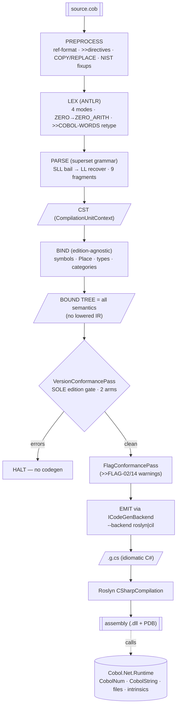
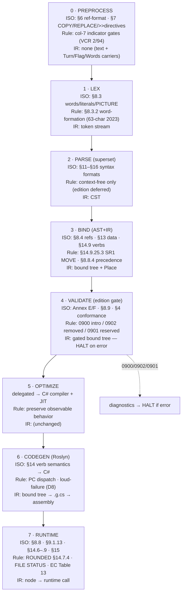

# Diagram — Compiler Pipeline

Visualizes [[kb/Compiler/Pipeline]]. Source `.cob` → typed bound tree → C# → Roslyn → `.dll`.

## Flowchart (Mermaid)

## The 6 phases (table)

| # | Phase | Input → Output | Project |
|---|---|---|---|
| 1 | Preprocess | text → normalized text | `Cobol.Net.Frontend/Preprocessor` |
| 2 | Lex | text → token stream | `Cobol.Net.Frontend` (ANTLR lexer) |
| 3 | Parse | tokens → CST | `Cobol.Net.Frontend` (superset parser) |
| 4 | Bind | CST → **bound tree** | `Cobol.Net.Compiler/Binding` |
| 5 | VersionConformancePass | bound tree → gated (HALT on error) | `Cobol.Net.Compiler/Validation` |
| 6 | Emit | bound tree → C# → assembly | `Cobol.Net.Compiler/CodeGen/Roslyn` |

## Invariants shown
- **No lowered IR** — one bound tree flows straight to the backend.
- **Edition gate is its own pass** and **halts before emit** on any error.
- **Emitters only render** — semantics are fixed at bind.
- Selectable backend (`roslyn` default; `cil` future) over the same bound tree.

## Annotated pipeline (ISO constructs · rules · IR)

Each phase, annotated with the ISO clause it centres on, the rule it enforces, and the IR it touches. The full
per-phase detail is in [[kb/Compiler/Pipeline-to-ISO-Mapping]].

### Phase → construct · rule · IR node (quick table)

| Phase | ISO constructs | Rules enforced | IR nodes / links |
|---|---|---|---|
| Preprocess | COPY/REPLACE, `>>` directives (§7) | ref-format §6 | — → [[kb/Spec/Lookup/Constraints]] |
| Lex | words, literals, PICTURE (§8.3) | word-formation §8.3.2 | tokens → [[kb/Spec/Lookup/Keywords]] |
| Parse | divisions/statements/expr (§11–§16) | syntax formats | CST → [[kb/Spec/Lookup/Grammar]] |
| Bind | data items, verbs, refs (§13/§14/§8.4) | MOVE SR1, precedence, category | `Bound*`, `Place` → [[kb/Spec/Lookup/IR Mapping]] |
| Validate | edition-varying constructs (Annex E/F) | 0900/0901/0902/0903 | gate → [[kb/Spec/Lookup/Semantic Rules]] |
| Codegen | all verbs (§14) | PC dispatch, loud-failure | render → [[kb/Spec/Lookup/IR Mapping]] |
| Runtime | numerics/files/intrinsics/EC (§8.8/§9/§14/§15) | ROUNDED, FILE STATUS, EC | calls → [[kb/Spec/Lookup/Runtime Mapping]] |

**Full mapping:** [[kb/Compiler/Pipeline-to-ISO-Mapping]].

## See also
- [[kb/Compiler/Pipeline]] · [[kb/Compiler/Phases]]
- [[kb/Diagrams/IR Graph Overview]] · [[kb/Diagrams/Semantic Validation Flow]]

## Backlinks
- [[kb/Diagrams/MOC]] · [[kb/Index]] — link here.
