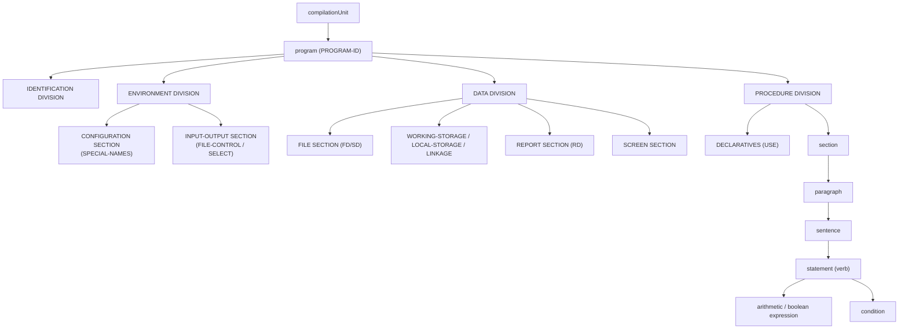

# Diagram — Grammar Hierarchy

The COBOL program hierarchy the parser recognizes (superset grammar, 9 ANTLR fragments). Feeds
[[kb/Spec/Lookup/Grammar]] and [[kb/Compiler/Phases]].

## Program → division → section → paragraph → statement



## Grammar fragments (physical split)

```
CobolParserCore.g4  ── imports ──▶  CobolExpressions · CobolData · CobolSpecialNames
                                    CobolReportWriter · CobolIO · CobolControlFlow
                                    CobolOO · CobolScreen · CobolWords
CobolLexer.g4  ── modes ──▶  DEFAULT · PICMODE · SUBSCRIPT · COMMENT_MODE
```

## Statement families (CobolControlFlow rules → IR)
| Grammar rule | Statement | IR node |
|---|---|---|
| `performStatement` | PERFORM | `BoundInlinePerform` / `BoundOutOfLinePerform` |
| `ifStatement` | IF | `BoundIf` |
| `evaluateStatement` | EVALUATE | `BoundEvaluate` |
| `goToStatement` | GO TO | `BoundGoTo` / `BoundGoToDepending` |
| `searchStatement` / `searchAllStatement` | SEARCH | `BoundSearch` |
| `exitStatement` | EXIT forms | `BoundExit*` |

## See also
- [[kb/Spec/Lookup/Grammar]] · [[kb/Compiler/Phases]]
- [[kb/Diagrams/Compiler Pipeline Diagram]] · [[kb/Diagrams/IR Node Hierarchy]]

## Backlinks
- [[kb/Diagrams/MOC]] · [[kb/Spec/Lookup/Grammar]] — link here.
