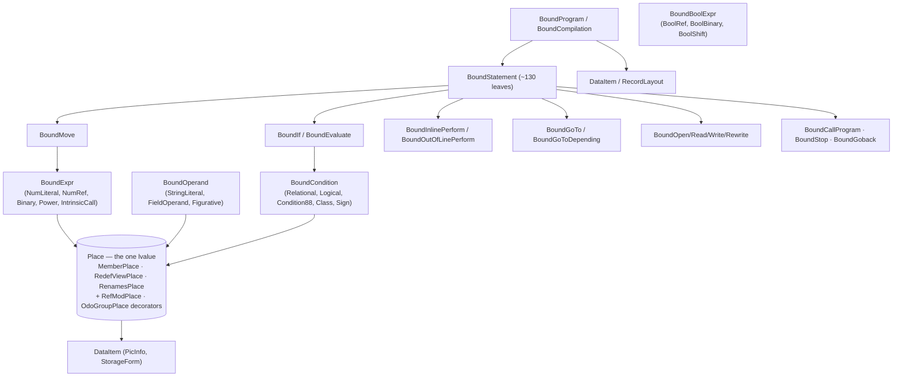

# Diagram — IR (Bound Tree) Graph

Visualizes [[kb/IR/Node Types]]. The bound tree is the single semantic model — there is **no lowered IR**.

## Bound-node hierarchy (Mermaid)



## The `Place` lvalue (structural addressing, not byte offsets)

```
Place
 ├── leaf kinds:  MemberPlace · DynTablePlace · RedefViewPlace · RenamesPlace
 │                CapacityRegisterPlace · DebugRegisterPlace
 └── decorators:  RefModPlace (a:b) · OdoGroupPlace · NumericImagePlace
        built once by ReferenceResolver → consumed by MOVE / arithmetic /
        INSPECT / STRING / file I/O / CALL-by-reference → rendered by PlaceRenderer
```

## The exhaustive visitor (why no duplicated switches)

```
[BoundNode] roots  ──►  BoundVisitorGenerator (Roslyn source generator)
                        discovers leaves via the semantic model
                        emits  I{Root}Visitor<T>  +  Accept<T>  dispatch
                        ⇒ a NEW leaf makes every consumer fail to COMPILE
                          (replaces ~205 hand-written `case Bound…` arms)
```

## See also
- [[kb/IR/Node Types]] · [[kb/IR/Data Flow]] · [[kb/IR/Control Flow]]
- [[kb/Diagrams/Compiler Pipeline Diagram]]

## Backlinks
- [[kb/Diagrams/MOC]] · [[kb/Index]] — link here.
