# Diagram — IR Node Hierarchy

The `[BoundNode]` root → leaf hierarchy (157 `Bound*` types; source-generated exhaustive visitor). Companion to
[[kb/Diagrams/IR Graph Overview]]; feeds [[kb/Spec/Lookup/IR Mapping]].

## Roots and their leaves

```mermaid
flowchart TD
    NODE["[BoundNode] roots"]
    NODE --> STMT["BoundStatement (~130 leaves)"]
    NODE --> EXPR["BoundExpr"]
    NODE --> OPER["BoundOperand"]
    NODE --> COND["BoundCondition"]
    NODE --> BOOL["BoundBoolExpr"]
    NODE --> PERF["BoundPerformControl"]
    STMT --> MV["data: BoundMove · BoundInitialize · BoundSetTo"]
    STMT --> AR["arith: BoundCompute · BoundAddTo · BoundDivide*"]
    STMT --> CF["flow: BoundIf · BoundEvaluate · BoundPerform* · BoundGoTo* · BoundExit*"]
    STMT --> IO["io: BoundOpen/Read/Write/Rewrite · BoundKeyed* · BoundSort"]
    STMT --> IP["call: BoundCallProgram · BoundCancel"]
    STMT --> OO["oo: BoundInvoke · BoundMethodReturn"]
    STMT --> EC["ec: BoundEcChecked · BoundRaise · BoundResume"]
    STMT --> RW["rw: BoundInitiate/Generate/Terminate"]
    STMT --> ERR["errors: BoundUnsupported · BoundNop"]
    EXPR --> E1["BoundBinary · BoundPower · BoundNumRef · BoundIntrinsicCall"]
    COND --> C1["BoundRelational · BoundLogical · BoundCondition88 · BoundClassCondition"]
    OPER --> O1["BoundStringLiteral · BoundFieldOperand · BoundFigurative"]
    PERF --> P1["PerformOnce · PerformTimes · PerformUntil · PerformVarying"]
```



## The source-generated visitor (why exhaustive)

```
[BoundNode] roots ─▶ BoundVisitorGenerator (Roslyn source generator)
                     • discovers sealed leaves via the semantic model (BaseType), never text
                     • emits I{Root}Visitor<T> + BoundVisitor.Accept<T>
                     • emits BoundStatementTree.StatementChildren (drift-proof nested walk)
  ⇒ a NEW leaf makes every consumer fail to COMPILE until handled
    (replaced ~205 hand-written `case Bound…` arms — closed the duplicated-switch bug class)
```

## See also
- [[kb/IR/Node Types]] · [[kb/Spec/Lookup/IR Mapping]]
- [[kb/Diagrams/IR Graph Overview]]

## Backlinks
- [[kb/Diagrams/MOC]] · [[kb/Spec/Lookup/IR Mapping]] — link here.
