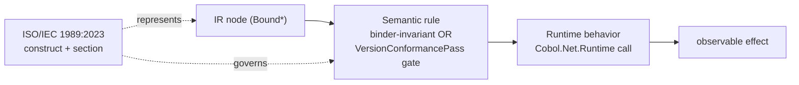

# IR to Semantic to Runtime Flow

For each major bound-tree (IR) node family, this note traces the path **IR node -> ISO spec construct -> semantic
validation rule(s) -> runtime behavior**. It is the visual companion that threads together, node-by-node, the three
lookup tables [[kb/Spec/Lookup/IR Mapping]], [[kb/Spec/Lookup/Semantic Rules]], and
[[kb/Spec/Lookup/Runtime Mapping]]. Every section is grounded in the actual source
(`BoundTree.cs`, the binders, the runtime classes) and was adversarially verified (node names, ISO section citations,
runtime class names, and wiki-links checked against the repo).

> **Each section reads:** **Spec mapping** (the ISO construct the node represents) -> **Semantic rules** (invariant
> binder check vs edition-conditional `VersionConformancePass` gate) -> **Runtime behavior** (the `Cobol.Net.Runtime`
> class it calls) -> an **ASCII flow** in the form `BoundX --[ rule / section ]--> runtime behavior (RuntimeClass)`.

## The pattern (overview)



**Legend for the ASCII flows:** `BoundNode  --[ semantic rule / ISO section ]-->  runtime behavior (RuntimeClass)`.
Node names are real `Bound*` record types from `src/Cobol.Net.Compiler/Binding/Bound/`; runtime names are real
classes from `src/Cobol.Net.Runtime/`.

## Node families (jump list)

- [[#Program structure & procedures]]
- [[#MOVE & data movement]]
- [[#Arithmetic (ADD/SUBTRACT/MULTIPLY/DIVIDE/COMPUTE)]]
- [[#Conditions]]
- [[#IF / EVALUATE]]
- [[#PERFORM (inline / out-of-line / VARYING)]]
- [[#GO TO / ALTER / EXIT / termination]]
- [[#SEARCH / SEARCH ALL]]
- [[#String operations (STRING/UNSTRING/INSPECT)]]
- [[#DISPLAY / ACCEPT]]
- [[#File I/O (OPEN/READ/WRITE/REWRITE/START/DELETE)]]
- [[#SORT / MERGE]]
- [[#Interprogram & pointers (CALL/CANCEL/ALLOCATE)]]
- [[#Object orientation (INVOKE/METHOD)]]
- [[#Conditions & Exceptions (EC engine)]]
- [[#Report Writer]]
- [[#Operands, literals, boolean & error nodes]]

---

## Program structure & procedures
*Nodes: `BoundProgram`, `BoundParagraph`, `BoundSequence`, `BoundDeclarative`, `BoundNop`, `BoundContinueAfter`*

**Spec mapping.** `BoundProgram` is a program/class definition (ISO §11) — its procedure division becomes one flat pc space of `BoundParagraph`s, each a named paragraph whose pc index is its position in `Paragraphs` (§14.4). `BoundDeclarative` is one USE declarative section (§14.9.49 — Format 1 file/mode error, Format 2 BEFORE REPORTING, Format 3 EXCEPTION CONDITION, Format 4 EXCEPTION OBJECT). `BoundNop` carries bare `EXIT`/`CONTINUE` (§14.9.14/§14.9.9). `BoundContinueAfter` is `CONTINUE AFTER n SECONDS` (COBOL-2023, §14.9.9). `BoundSequence` has no ISO construct — a bind-time desugar carrier (D-P2). See [[kb/Spec/Lookup/Grammar]], [[kb/Spec/Lookup/IR Mapping]], [[kb/Spec/Language Features]].

**Semantic rules.** Paragraph/section name uniqueness and pc-range containment are binder invariants; USE-declarative scope (files/open-mode/EC-name) is resolved in `BoundDeclarative` at bind. `CONTINUE AFTER … SECONDS` is edition-conditional — `VersionConformancePass` gates `Constructs.ContinueAfter2023`, rejecting it below COBOL-2023; a negative interval is forced to 0 and, under enabled checking, sets nonfatal EC-CONTINUE-LESS-THAN-ZERO (§14.9.9 GR1a/GR1b). See [[kb/Semantics/Validation Rules]], [[kb/Spec/Lookup/Semantic Rules]], [[kb/Semantics/Passes]].

**Runtime behavior.** DispatchEmitter renders the paragraphs as one `switch(pc)` inside `__Dispatch(startPc, exitPc)`; the run unit (`RunUnit`, `ModuleStack`) owns lifetime state. Declaratives fire via generated `__RunUse`/`__EcDispatch`/`__IoCheckEc` on an I/O or EC event. `BoundContinueAfter` calls `CobolTiming.ContinueAfter`; `BoundNop` emits nothing; `BoundSequence` renders children in line. See [[kb/Runtime/Execution Model]], [[kb/Spec/Lookup/Runtime Mapping]].

```text
BoundProgram      --[ §11 program/class ]-->            emitted class + __Dispatch(startPc,exitPc)   (RunUnit)
  BoundParagraph  --[ §14.4 pc index ]-->               one case in switch(pc)                       (DispatchEmitter)
  BoundDeclarative--[ §14.9.49 USE, I/O or EC event ]--> __RunUse / __EcDispatch / __IoCheckEc        (RunUnit.Exceptions)
BoundSequence     --[ D-P2 desugar, no pc ]-->          children rendered consecutively in line       (StatementEmitter)
BoundNop          --[ §14.9.9/§14.9.14 bare EXIT/CONTINUE ]--> no-op (nothing emitted)
BoundContinueAfter--[ §14.9.9 GR1a/b + ContinueAfter2023 gate ]--> timed pause / EC-CONTINUE-LESS-THAN-ZERO (CobolTiming)
```

## MOVE & data movement
*Nodes: `BoundMove`, `BoundCorresponding`, `BoundInitialize`, `BoundSetTo`, `BoundSetUpDown`, `BoundSetConditions`*

**Spec mapping.** `BoundMove` is MOVE Format 1 (ISO §14.9.25); it carries per-target `MoveKind`s classified once by `MoveClassifier`. `BoundCorresponding` is the Format-2 CORRESPONDING family expanded at bind into declaration-order pairs (MOVE §14.9.25.2, ADD §14.9.2.2, SUBTRACT §14.9.44.2; identification-once §14.7.6). `BoundInitialize` (§14.9.20) is expanded at bind into a series of implicit elementary MOVEs (GR4) plus per-OCCURS loops (GR5b2) — no runtime INITIALIZE exists. `BoundSetTo` is SET Format 1 (index-assignment, §14.9.39, sending value determined once GR2); `BoundSetUpDown` is SET Format 2 (index-arithmetic, §14.9.39, amount-once GR3 then per-index adjust GR4); `BoundSetConditions` is SET condition-name TO TRUE (Format 4; stores each level-88's first VALUE into its parent place). See [[kb/Spec/Lookup/IR Mapping]], [[kb/Spec/Lookup/Grammar]], [[kb/Spec/Language Features]].

**Semantic rules.** The class-index prohibition (§14.9.25.3 SR1) is **invariant**, enforced in `MoveBinder` as `COBOLNET0809` for both operands; Table-16 category legality (SR7/SR8/SR10) is likewise bind-time. The figurative-constant category gates (§14.9.25.3 SR5) are **edition-conditional**, checked in `VersionConformancePass` (`COBOLNET0902`/`COBOLNET0903`), with ref-mod/group/non-numeric receivers exempted. See [[kb/Semantics/Validation Rules]], [[kb/Spec/Lookup/Semantic Rules]], [[kb/Semantics/Passes]].

**Runtime behavior.** Every store flows through a `Place` lvalue: numeric receivers convert via `CobolNum.Store`/`TryStore` (rescale, rounding, SIZE ERROR §14.7.5), alphanumeric via `CobolString` (justify/pad/truncate). CORRESPONDING/INITIALIZE reuse the single MOVE path per pair/action. See [[kb/Runtime/Execution Model]], [[kb/Spec/Lookup/Runtime Mapping]], [[kb/IR/Data Flow]].

```text
BoundMove          --[ SR1 index=0809 (MoveBinder) / SR5=0902/0903 (VCPass) §14.9.25.3 ]--> category convert  (CobolNum.Store / CobolString)
BoundCorresponding --[ pairs in decl order §14.7.6; MOVE/ADD/SUBTRACT ]-------------------> per-pair store    (CobolNum / CobolString)
BoundInitialize    --[ expand to implicit MOVEs §14.9.20 GR4/GR5b2 ]---------------------> per-action store  (CobolNum / CobolString)
BoundSetTo         --[ SET Format 1 §14.9.39 ]-------------------------------------------> write index/target (Place lvalue)
BoundSetUpDown     --[ amount-once GR3, per-index adjust GR4 §14.9.39 ]------------------> read-modify-write  (Place lvalue)
BoundSetConditions --[ store 88 first VALUE into parent ]-------------------------------> write parent       (Place lvalue)
```

## Arithmetic (ADD/SUBTRACT/MULTIPLY/DIVIDE/COMPUTE)
*Nodes: `BoundCompute`, `BoundAddTo`, `BoundAddGiving`, `BoundSubtractFrom`, `BoundSubtractGiving`, `BoundMultiplyBy`, `BoundMultiplyGiving`, `BoundDivideInto`, `BoundDivideGiving`, `BoundDivideRemainder`, `BoundBinary`, `BoundNegate`, `BoundPower`, `SizeErrorPhrase`*

**Spec mapping.** The statement nodes are the ISO arithmetic verbs: ADD §14.9.2, SUBTRACT §14.9.44, MULTIPLY §14.9.26, DIVIDE §14.9.12 (its REMAINDER Formats 4–5 → `BoundDivideRemainder`), and COMPUTE §14.9.8, each split into TO/FROM/BY/INTO vs GIVING forms so the binder distinguishes composite operands from resultants (§14.7.7). `BoundBinary`, `BoundNegate`, `BoundPower` are the arithmetic-expression tree of §8.8.1 (COMPUTE's RHS and any operand). `Receiver` carries the ROUNDED mode (§14.7.4); `SizeErrorPhrase` is ON/NOT ON SIZE ERROR (§14.7.5). See [[kb/Spec/Lookup/IR Mapping]], [[kb/Spec/Lookup/Grammar]], [[kb/Spec/Language Features]].

**Semantic rules.** Invariant binder checks (`ArithmeticBinder`): operands numeric, resultants numeric receivers, and the intermediate-result composite computed *excluding* GIVING resultants (§14.7.7 rule 2, guarding COBOLNET0805); DIVIDE…REMAINDER requires exactly one GIVING receiver (§14.9.12 SR6). These are version-invariant. See [[kb/Semantics/Validation Rules]], [[kb/Spec/Lookup/Semantic Rules]], [[kb/Semantics/Passes]].

**Runtime behavior.** Each resultant store funnels through `CobolNum.TryStore` (Int128-monomorphic), applying the resultant scale under one of eight `CobolRounding` modes; `false` = size error. Zero divisor / PROHIBITED-inexact / overflow raise `CobolSizeError` (`ecName` EC-SIZE-ZERO-DIVIDE / -EXPONENTIATION / -OVERFLOW), caught by the emitted SIZE ERROR wrapper. See [[kb/Runtime/Execution Model]], [[kb/Spec/Lookup/Runtime Mapping]].

```text
BoundAddTo/AddGiving        --[ ADD §14.9.2 ]------------------>  Σ addends, store each resultant  (CobolNum.TryStore)
BoundSubtractFrom/Giving    --[ SUBTRACT §14.9.44 ]------------>  minuend − Σ, store              (CobolNum.TryStore)
BoundMultiplyBy/Giving      --[ MULTIPLY §14.9.26 ]------------>  a × b, store                    (CobolNum.TryStore)
BoundDivideInto/Giving      --[ DIVIDE §14.9.12; ÷0 ]---------->  quotient; ÷0 → CobolSizeError    (CobolNum.TryStore)
BoundDivideRemainder        --[ DIVIDE §14.9.12 GR7 ]---------->  trunc quotient, r = d−(q×dv)     (CobolNum.TryStore)
BoundCompute                --[ COMPUTE §14.9.8 ]-------------->  eval expr tree, store           (CobolNum.TryStore)
BoundBinary/Negate/Power    --[ arith expr §8.8.1 ]----------->  intermediate value (Int128/CobolDec/CobolFloat)
Receiver.Rounding           --[ ROUNDED §14.7.4 ]------------->  8 CobolRounding modes           (CobolRounding)
SizeErrorPhrase             --[ ON SIZE ERROR §14.7.5 ]------->  try/catch(CobolSizeError) wrap   (CobolSizeError)
```

## Conditions
*Nodes: `BoundRelational`, `BoundLogical`, `BoundNot`, `BoundCondition88`, `BoundRangeMembership`, `BoundClassCondition`, `BoundUserClassCondition`, `BoundSignCondition`, `BoundSwitchCondition`, `BoundBooleanCondition`*

**Spec mapping.** These leaves of the abstract `BoundCondition` (COBOLNET_DESIGN §11) cover every ISO conditional expression. `BoundRelational` is the relation condition (§8.8.4.2), including the Format-2 boolean relation (§8.8.4.2.2); `BoundLogical`/`BoundNot` are the combined condition (§8.8.4.13 — NOT > AND > OR precedence, short-circuit rules 1–2). `BoundCondition88` is the condition-name test (§8.8.4.5), `BoundRangeMembership` its/EVALUATE THRU range (§14.7.8). `BoundClassCondition` + `BoundUserClassCondition` are the class condition (§8.8.4.1.4, SPECIAL-NAMES class §12.3.7); `BoundSignCondition` the sign condition (§8.8.4.7, IEEE Format-2 §8.8.4.7.4 GR2); `BoundSwitchCondition` the switch-status condition (§8.8.4.6); `BoundBooleanCondition` the simple boolean condition (§8.8.4.3). See [[kb/Spec/Lookup/IR Mapping]], [[kb/Spec/Lookup/Grammar]], [[kb/Spec/Language Features]].

**Semantic rules.** Most rules are binder-invariant in `ConditionBinder`: a boolean relation admits only EQUAL/NOT EQUAL (§8.8.4.2.2 — no ordering), both operands boolean-valued, a simple boolean condition references only length-1 boolean items (§8.8.4.3 SR1) — all raise `COBOLNET1511`. Boolean-literal (`B"…"`) and boolean-operator *recognition* is edition-gated in `VersionConformancePass` (2002+). See [[kb/Semantics/Validation Rules]], [[kb/Spec/Lookup/Semantic Rules]], [[kb/Semantics/Passes]].

**Runtime behavior.** `ConditionRenderer` emits pure, short-circuiting parenthesized C# booleans (no side effects, §11). Relations lower to scale-aligned integer/`CobolDec.Compare`/`CobolString.Compare`; class tests to `CobolClass.IsNumeric`/`IsAlphabetic`/`IsInClass`; simple boolean to `CobolBool.IsTrue`; switches to `ExternalSwitches.Get`; ranges to `CobolString.ThruMember` (sets nonfatal EC-RANGE-INVALID). See [[kb/Runtime/Execution Model]], [[kb/Spec/Lookup/Runtime Mapping]].

```text
BoundRelational       --[ relation §8.8.4.2 ]-------------->  scaled ints / CobolDec.Compare / CobolString.Compare
BoundLogical / Not    --[ combined §8.8.4.13 ]------------->  ( a && b ) / ( a || b ) / ^ / !(a)   short-circuit
BoundCondition88      --[ cond-name §8.8.4.5 GR2 ]--------->  OR of membership compares (CobolString.Compare)
BoundRangeMembership  --[ THRU range §14.7.8 r2 ]---------->  CobolString.ThruMember  (sets EC-RANGE-INVALID)
BoundClassCondition   --[ class §8.8.4.1.4 ]--------------->  CobolClass.IsNumeric/IsAlphabetic[Upper|Lower]
BoundUserClassCondition --[ class §12.3.7 ]--------------->  CobolClass.IsInClass(operand, members)
BoundSignCondition    --[ sign §8.8.4.7 / .7.4 GR2 ]------>  v>0 / v<0 / v==0  |  double.IsNegative (Format-2)
BoundSwitchCondition  --[ switch §8.8.4.6 GR1 ]----------->  ExternalSwitches.Get(name)  ([!])
BoundBooleanCondition --[ simple boolean §8.8.4.3 ]------->  CobolBool.IsTrue(expr)
```

## IF / EVALUATE
*Nodes: `BoundIf`, `BoundEvaluate`, `BoundEvaluateWhen`, `BoundWhenOperand`*

**Spec mapping.** `BoundIf` is the IF statement (ISO **§14.9.19**): a condition whose truth selects `Then` vs `Else`. `BoundEvaluate` is EVALUATE (ISO **§14.9.13**) — the general case/selection construct — carrying an ordered `Whens` list plus an optional `Other` (WHEN OTHER) tail. Each `BoundEvaluateWhen` is one arm: a single composed `BoundCondition Match` (the AND over its subject↔object pairs, consecutive WHEN phrases OR-folded over a shared body per §14.9.13 GR) and its `Statements`. `BoundWhenOperand` is *not* an EVALUATE arm — it is the WHEN-selector operand of the Format-3 exception-checking PERFORM (§14.9.28.3 SR16 / §14.9.49.4): an exception-name, an optional paired FILE, or a bare file-name. See [[kb/Spec/Lookup/Grammar]], [[kb/Spec/Lookup/IR Mapping]], [[kb/Spec/Language Features]].

**Semantic rules.** Invariant binder rules (`EvaluateBinder`): subject↔object pairing is positional across ALSO and the per-WHEN object count must not exceed the subject count — a violation lowers to `BoundUnsupported` ("more WHEN objects than subjects", §14.9.13 SR); TRUE/FALSE subjects pair with condition objects, value subjects with equality/THRU-range/condition objects (§14.9.13 GR4–7). These selection semantics are edition-invariant (no VersionConformancePass gate). See [[kb/Semantics/Validation Rules]], [[kb/Spec/Lookup/Semantic Rules]].

**Runtime behavior.** No runtime-library call. `ControlFlowEmitter.EmitIf` writes a C# `if`/`else`; `EvaluateEmitter.Emit` writes a chained `if / else if / else` (first true arm wins, `Other` = else tail, WHEN-OTHER-only = unconditional). Each match/condition is rendered by `ConditionRenderer` into a native boolean C# expression evaluated in place. See [[kb/Runtime/Execution Model]], [[kb/Spec/Lookup/Runtime Mapping]].

```text
BoundIf            --[ §14.9.19 truth of Condition        ]-->  C# if / else            (ControlFlowEmitter.EmitIf)
BoundEvaluate      --[ §14.9.13 GR1-3 first true arm       ]-->  C# if / else if / else  (EvaluateEmitter.Emit)
  └ BoundEvaluateWhen --[ §14.9.13 GR4-7 subject↔object AND/OR ]-->  one arm's condition (ConditionRenderer.Render)
BoundWhenOperand   --[ §14.9.49.4 GR3c-g tiered EC/file match ]-->  Format-3 PERFORM WHEN selector (not EVALUATE)
```

## PERFORM (inline / out-of-line / VARYING)
*Nodes: `BoundInlinePerform`, `BoundOutOfLinePerform`, `BoundPerformControl`, `PerformOnce`, `PerformTimes`, `PerformUntil`, `PerformVarying`, `PerformForever`*

**Spec mapping.** All eight nodes realize the `PERFORM` statement of ISO §14.9.28. `BoundInlinePerform` (`PERFORM … END-PERFORM`) and `BoundOutOfLinePerform` (`PERFORM proc-1 [THRU proc-2]`) are the two syntactic shells; the `BoundPerformControl` hierarchy models the repetition clause independently of the procedure range (§14.9.28 general format): `PerformOnce` (no phrase), `PerformTimes` (Format 2, GR9), `PerformUntil` (Format 3 UNTIL, TEST BEFORE/AFTER), `PerformVarying` (Format 4 VARYING/AFTER, GR13), and `PerformForever` — the COBOL-2023 `UNTIL EXIT` infinite loop (§14.9.28.4 GR11). Each `VaryingLevel` keeps FROM/BY as live expressions (GR12). See [[kb/Spec/Lookup/Grammar]], [[kb/Spec/Lookup/IR Mapping]], [[kb/Spec/Language Features]].

**Semantic rules.** The repetition shape and THRU-range resolution are invariant binder work (`ControlFlowBinder.BindPerformControl`/`BindVarying`), which also sets the GR3 index-range guard flag (`CheckIndexRange`) when an index-name is varied from a data-item FROM (§14.9.28.4 GR3); the emitter then materializes the actual runtime check. Edition-conditional gates live in `VersionConformancePass`: `UNTIL EXIT` (`PerformForever`) is introduction-gated at COBOL-2023 via **COBOLNET0900**; Format-3 exception PERFORM is discriminated by the shared `IsFormat3` (and also gated via COBOLNET0900). See [[kb/Semantics/Validation Rules]], [[kb/Spec/Lookup/Semantic Rules]], [[kb/Semantics/Passes]].

**Runtime behavior.** Inline PERFORMs lower to native C# loops (`for`/`while`/`do…while`/`while(true)`); `EXIT PERFORM` is a `goto __pexit`, `EXIT PERFORM CYCLE` a `goto __pcont` to the loop-control (augment/retest) boundary — except a Format-3 handler EXIT, which throws `ExitPerformSignal` (id-matched) to unwind nested dispatcher frames. Out-of-line PERFORMs recurse through the bounded `__Dispatch(startPc, exitPc)` return-address dispatcher. VARYING re-initializes each inner level from its current FROM after the outer level augments (GR13e). See [[kb/Runtime/Execution Model]], [[kb/Spec/Lookup/Runtime Mapping]], [[kb/IR/Control Flow]].

```text
                        PERFORM family (ISO §14.9.28)
  BoundInlinePerform  --[ native loop over bound body ]-->  C# for/while/do (StatementEmitter)
  BoundOutOfLinePerform --[ §14.9.28 THRU range      ]-->  recursive __Dispatch(startPc,exitPc) (DispatchEmitter)
    control ─┬─ PerformOnce    --[ run body once            ]--> straight-line body
             ├─ PerformTimes   --[ GR9  N iterations        ]--> for (i<n)
             ├─ PerformUntil   --[ TEST BEFORE→while / AFTER→do ]--> while(!c) / do…while(!c)
             ├─ PerformVarying --[ GR13 nested induction; inner re-init on outer augment ]--> nested while(!until)
             └─ PerformForever --[ §14.9.28.4 GR11 (2023) UNTIL EXIT ]--> while(true)
  EXIT PERFORM (handler, Format 3) --[ §14.9.14.4 GR4 ]--> throw ExitPerformSignal(id) → unwind
```

## GO TO / ALTER / EXIT / termination
*Nodes: `BoundGoTo`, `BoundGoToDepending`, `BoundGoToAlterable`, `BoundAlter`, `BoundAlterEntry`, `BoundExitParagraph`, `BoundExitSection`, `BoundExitPerform`, `BoundExitProgram`, `BoundNextSentence`, `BoundStop`, `BoundStopLiteral`, `BoundGoback`*

**Spec mapping.** These carry the procedure-division transfer and termination verbs. `BoundGoTo`/`BoundGoToDepending` are GO TO Formats 1–2 (ISO §14.9.20; DEPENDING out-of-range falls through). `BoundAlter`/`BoundAlterEntry`/`BoundGoToAlterable` are the alterable GO TO + ALTER (§14.9.2) — obsolete in ANSI-85, deleted at 2002. EXIT forms are §14.9.14: `BoundExitParagraph` (fall-through), `BoundExitSection` Format 4, `BoundExitPerform` [CYCLE], `BoundExitProgram` Format 2. `BoundNextSentence` is §14.9.19 GR6. Termination: `BoundStop`/`BoundStopLiteral` (§14.9.42, literal deleted 2002), `BoundGoback` (§14.9.18). See [[kb/Spec/Lookup/IR Mapping]], [[kb/Spec/Lookup/Grammar]], [[kb/Spec/Language Features]].

**Semantic rules.** Transfer-target resolution to a pc is invariant binder work. Edition gating is recognition-based in `VersionConformancePass`: `AlterRemoved2002` (ALTER §14.9.2), `BareGotoRemoved2002` (target-less/alterable GO TO §14.9.17), `ExitSection2002`, `StopLiteralRemoved2002`, and `StopRunStatus2002`/GOBACK STATUS (2002/2023). See [[kb/Semantics/Validation Rules]], [[kb/Spec/Lookup/Semantic Rules]], [[kb/Semantics/Passes]].

**Runtime behavior.** Transfers emit `__pc = target; break;` into the PC dispatcher switch (no runtime class). `BoundExitPerform` in a Format-3 (exception-checking) PERFORM handler unwinds via `ExitPerformSignal`. `BoundStop` throws `StopRun` (caught at the run-unit wrapper). `BoundGoback` and a called-program `BoundExitProgram` throw `ProgramReturn`, caught at that program's activation entry — for a main program the activation entry IS the run-unit wrapper, so a main-program GOBACK ends the run unit (≡ STOP, §14.9.18 GR3); exit status flows through `RunUnit.ExitStatus`. See [[kb/Runtime/Execution Model]], [[kb/Spec/Lookup/Runtime Mapping]].

```text
  BoundGoTo / BoundGoToDepending  --[ §14.9.20 F1/F2, invariant ]-->  __pc = target; break  (PC dispatcher)
  BoundGoToAlterable + BoundAlter --[ §14.9.2 / BareGoto+AlterRemoved2002 ]-->  __pc = _alter_X; break
  BoundExitParagraph              --[ §14.9.14 F4 ]-->               fall-through to paragraph end
  BoundExitSection                --[ §14.9.14 F4 / ExitSection2002 ]-->  __pc = SectionEndPc+1 (or return)
  BoundExitPerform [CYCLE]        --[ §14.9.14 F3 ]-->               goto __pexit / ExitPerformSignal
  BoundNextSentence               --[ §14.9.19 GR6 ]-->             transfer to post-period CONTINUE
  BoundStop (STOP RUN)            --[ §14.9.42 ]-->                 throw StopRun        -> RunUnit.ExitStatus (run-unit wrapper)
  BoundStopLiteral                --[ §14.9.42 F2 / StopLiteralRemoved2002 ]-->  write operator channel; continue
  BoundGoback / BoundExitProgram  --[ §14.9.18 GR2/GR3 / §14.9.14 GR2/GR3 ]-->  throw ProgramReturn  -> activation entry (main entry = run-unit wrapper ≡ STOP)
```

## SEARCH / SEARCH ALL
*Nodes: `BoundSearch`, `BoundSearchWhen`*

**Spec mapping.** `BoundSearch` represents both formats of the SEARCH verb (ISO §14.9.37): Format 1 serial scan and Format 2 `SEARCH ALL` binary/key-ordered scan, distinguished by the `FromStart` flag. Each `WHEN` arm becomes one `BoundSearchWhen(Condition, Statements)`; the optional `AT END` block is `AtEnd`. `VARYING` binds to `AlsoVaried` — a same-table index folds into the search index (GR8a), a foreign index/data item rides in step (GR8b/c). See [[kb/Spec/Lookup/Grammar]], [[kb/Spec/Lookup/IR Mapping]], [[kb/Spec/Language Features]].

**Semantic rules.** Binder-invariant (`SearchBinder`): the operand must be a table with `INDEXED BY` (§14.9.37 SR1) — else `BoundUnsupported`; `NOT AT END` is rejected as non-ISO. Nested dynamic-capacity tables lacking a whole-table path are refused (D9). EC gating (§14.9.37.4 GR4) is edition/turn-conditional via `ctx.EcState.Turn`: `CheckSearchIndex` (serial only) and `CheckSearchNoMatch`; `SEARCH ALL` forces index 1 (GR9) so only NO-MATCH can arise. See [[kb/Semantics/Validation Rules]], [[kb/Spec/Lookup/Semantic Rules]], [[kb/Semantics/Passes]].

**Runtime behavior.** `ControlFlowEmitter.EmitSearch` is the entry for BOTH formats and delegates to the shared inner `EmitSearchScan`, which renders an inline label-loop scan over the OCCURS array (index-name a `long`). An initial-index guard, then WHEN tests in order (first true wins), then advance-by-1; failure funnels to `AT END`. Range ECs raise via `ExceptionState.Set`; a dynamic table brackets the scan with `EnterSearch`/`ExitSearch` in try/finally (EC-FLOW-SEARCH, §14.9.39 GR31). See [[kb/Runtime/Execution Model]], [[kb/Spec/Lookup/Runtime Mapping]].

```text
BoundSearch(FromStart=false) --[ §14.9.37 F1 GR5–8 serial scan from current index ]--> EmitSearch → EmitSearchScan: init guard (idx<1||>bound), WHEN order, +1 advance
BoundSearch(FromStart=true)  --[ §14.9.37 F2 GR9 index:=1 ]-------------------------> EmitSearch(idx=1) → EmitSearchScan: scan from occ 1, NO-MATCH on empty/off-end
  └─ BoundSearchWhen         --[ §14.9.37.4 GR5b re-eval/pass ]----------------------> if(cond){ body; goto __searchEnd } (per-eval UDF wrapper)
     range EC (GR4)          --[ EC-RANGE-SEARCH-INDEX / -NO-MATCH ]-----------------> ExceptionState.Set(...)
     DynTable (D9)           --[ §14.9.39 GR31 EC-FLOW-SEARCH ]----------------------> Enter/ExitSearch try/finally
```

## String operations (STRING/UNSTRING/INSPECT)
*Nodes: `BoundStringStmt`, `BoundStringSending`, `BoundUnstringStmt`, `BoundUnstringReceiver`, `BoundUnstringDelimiter`, `BoundInspect`, `BoundInspectTally`, `BoundInspectReplace`, `BoundInspectConvert`*

**Spec mapping.** `BoundStringStmt` (+ per-sender `BoundStringSending`) models STRING … DELIMITED … INTO … [POINTER] [ON OVERFLOW] (ISO §14.9.43); the binder back-propagates each run's `DELIMITED` phrase, a trailing run defaulting to BY SIZE (SR9). `BoundUnstringStmt` with its `BoundUnstringReceiver` / `BoundUnstringDelimiter` children models UNSTRING (§14.9.48). `BoundInspect` covers all four INSPECT formats (§14.9.22): flattened `BoundInspectTally` (ALL/LEADING/CHARACTERS), `BoundInspectReplace` (ALL/FIRST/LEADING/CHARACTERS), and `BoundInspectConvert`, with `Backward` for 2023. See [[kb/Spec/Lookup/IR Mapping]], [[kb/Spec/Lookup/Grammar]], [[kb/Spec/Language Features]].

**Semantic rules.** Invariant binder checks: STRING SR2 (no ALL figurative), SR4 (no ref-modified receiver), SR5 (no edited receiver), SR7 (integer pointer, no P); UNSTRING SR2/SR4/SR5/SR6/SR7/SR10 — violations become `BoundUnsupported`/`BoundOperandError`. Edition-conditional: INSPECT BACKWARD is 2023-only, gated in `VersionConformancePass` (`Constructs.InspectBackward2023`, VCR 77). Ref-mod slices raise EC-BOUND-REF-MOD at run time. See [[kb/Semantics/Validation Rules]], [[kb/Spec/Lookup/Semantic Rules]], [[kb/Semantics/Passes]].

**Runtime behavior.** The emitter unrolls operand lists and calls `CobolStringOps.StringTransfer` (one per sender; per-character GR8 range check sets overflow) / `UnstringExtract` (one per receiver; earliest-match delimiter, ALL collapse, COUNT/pointer), and `CobolInspect.Tally`/`Replace`/`Convert` over one GR8 comparison cycle. Values flow in/out as .NET strings, stored once through the `Place` lvalue. See [[kb/Runtime/Execution Model]], [[kb/Spec/Lookup/Runtime Mapping]].

```text
BoundStringStmt/BoundStringSending --[ §14.9.43 SR2/4/5/7; GR8 overflow ]--> per-sender transfer, POINTER++ (CobolStringOps.StringTransfer)
BoundUnstringStmt                  --[ §14.9.48 GR9/GR10 earliest match ]--> split source into receivers/COUNT/DELIM (CobolStringOps.UnstringExtract)
  ├─ BoundUnstringReceiver         --[ SR4/SR10; GR11b size ]-----------> one extract → Place store
  └─ BoundUnstringDelimiter        --[ GR7 ALL collapse ]---------------> delimiter selection
BoundInspect                       --[ §14.9.22 GR8 shared cycle ]------> scan Target image once
  ├─ BoundInspectTally             --[ Format 1 ALL/LEADING/CHARS ]-----> counter += matches (CobolInspect.Tally)
  ├─ BoundInspectReplace           --[ Format 2 GR14 equal-length ]-----> in-place replace (CobolInspect.Replace)
  └─ BoundInspectConvert           --[ Format 4 GR20 positional map ]---> char translate (CobolInspect.Convert)
  Backward=true                    --[ 2023 gate: VersionConformancePass ]--> reversed-forward scan
```

## DISPLAY / ACCEPT
*Nodes: `BoundDisplay`, `BoundAccept`*

**Spec mapping.** `BoundDisplay(Operands, NoAdvancing, ToStdErr)` is the DISPLAY statement (ISO §14.9.11): each operand is imaged to a string and concatenated; `NoAdvancing` is `WITH NO ADVANCING`, `ToStdErr` records UPON routing to SYSERR (§14.9.11.4 GR8). `BoundAccept(Target, Kind)` is ACCEPT (ISO §14.9.1): `AcceptKind.Device` is the Format-1 hardware transfer (GR1–GR5), while `Date/DateYYYYMMDD/Day/DayYYYYDDD/Time/DayOfWeek` are the Format-2 temporal readings (GR7–GR12). `HasEndTerminator` records `END-ACCEPT`. See [[kb/Spec/Lookup/Grammar]], [[kb/Spec/Lookup/IR Mapping]], [[kb/Spec/Language Features]].

**Semantic rules.** Invariant (binder, `AcceptDisplayBinder`): an ACCEPT receiver of class index is rejected `COBOLNET0818` (§14.9.1.3 SR1/SR3); `ACCEPT … FROM mnemonic` must be a SPECIAL-NAMES device capable of input (CONSOLE/SYSIN), else `COBOLNET0817` (SR2); DISPLAY UPON validates against output-capable devices (SR2). Edition-conditional (`VersionConformancePass`): `AcceptFourDigitYear2002` gates `YYYYMMDD`/`YYYYDDD`, and `EndAccept2002` gates `END-ACCEPT`. See [[kb/Semantics/Validation Rules]], [[kb/Spec/Lookup/Semantic Rules]], [[kb/Semantics/Passes]].

**Runtime behavior.** DISPLAY emits `System.Console.Write/WriteLine` (or `Console.Error` for SYSERR). ACCEPT Format-1 calls `AcceptSource.Device(n)` (80-char card-image reads, aligned-left store); Format-2 calls `AcceptSource.Date/Time/...`, each reading `RunUnit.Current.Clock.Now()` via injectable `IClock`/`SystemClock` (COBOLNET_CLOCK pin for deterministic goldens), then stored by the MOVE rules. See [[kb/Runtime/Execution Model]], [[kb/Spec/Lookup/Runtime Mapping]].

```text
BoundDisplay  --[ §14.9.11 image + UPON routing ]-->  Console.Write/WriteLine | Console.Error  (System.Console)

BoundAccept
 ├─ Device        --[ §14.9.1.4 GR1–GR5 aligned-left store ]-->  AcceptSource.Device(n)
 └─ temporal      --[ §14.9.1.4 GR6–GR12 MOVE-rule store   ]-->  AcceptSource.{Date,DateYYYYMMDD,Day,
      Date/Day/Time/DayOfWeek                                        DayYYYYDDD,Time,DayOfWeek}
                                                                     -> RunUnit.Current.Clock.Now()  (IClock/SystemClock)
```

## File I/O (OPEN/READ/WRITE/REWRITE/START/DELETE)
*Nodes: `BoundOpen`, `BoundClose`, `BoundRead`, `BoundKeyedRead`, `BoundWrite`, `BoundKeyedWrite`, `BoundAdvancing`, `BoundRewrite`, `BoundKeyedRewrite`, `BoundKeyedStart`, `BoundKeyedDelete`, `BoundKeyedDeleteFile`, `BoundUnlock`*

**Spec mapping.** These nodes bind the ISO §14.9 I-O verbs. `BoundOpen`/`BoundClose` carry `OPEN {INPUT|OUTPUT|I-O|EXTEND}` (§14.9.27) and `CLOSE … [WITH LOCK|REEL/UNIT]` (§14.9.6), including the OPEN SHARING (§14.9.27) and RETRY (§14.7.9) phrases. `BoundRead` is sequential `READ … [NEXT] [AT END]` (§14.9.30); `BoundKeyedRead` adds NEXT/PREVIOUS/random by key-of-reference. `BoundWrite`+`BoundAdvancing` cover `WRITE … {BEFORE|AFTER} ADVANCING` including the COBOL-2023 combined form (§14.9.51 GR25e/f), `BoundKeyedWrite` the relative/indexed forms (§14.9.51 GR29–GR42). `BoundRewrite`/`BoundKeyedRewrite` map §14.9.35; `BoundKeyedStart` §14.9.41 (FIRST/LAST are 2002+); `BoundKeyedDelete` §14.9.10 Format 1, `BoundKeyedDeleteFile` the 2023 `DELETE FILE` Format 2; `BoundUnlock` §14.9.47. See [[kb/Spec/Lookup/Grammar]] and [[kb/Spec/Lookup/IR Mapping]].

**Semantic rules.** Organization/access consistency and the last-read prerequisite for REWRITE/DELETE are invariant binder checks (KeyedIoBinder), carrying a loud `Unsupported` reason rather than silently dropping. INVALID KEY vs AT END phrase legality follows §9.1.14. Edition gates — FIRST/LAST START, `DELETE FILE`, combined WRITE — fire on node SHAPE in the VersionConformancePass, not the binder ([[kb/Semantics/Passes]]). See [[kb/Semantics/Validation Rules]] and [[kb/Spec/Lookup/Semantic Rules]].

**Runtime behavior.** Emitters call the static `CobolFile` facade, a pure delegator onto the run-unit's `FileRegistry` (`RunUnit.Current.Files`), which polymorphically dispatches to `SequentialConnector`, `RelativeConnector`, or `IndexedConnector`. Each connector method (`Write`, `Rewrite`, `ReadNext`, `ReadRandom`, `Start`, `Delete`) owns the §9.1.13 two-char status returned to the FILE STATUS item; records cross as their character-image `string`. See [[kb/Runtime/Execution Model]] and [[kb/Spec/Lookup/Runtime Mapping]].

```text
BoundOpen         --[ OPEN modes §14.9.27 / SHARING §14.9.27 ]--> registry.Open(mode)          (FileRegistry → FileConnector.Open)
BoundClose        --[ CLOSE §14.9.6 / WITH LOCK ]-------------->  registry.Close/CloseWithLock  (FileConnector.Close)
BoundRead         --[ seq READ §14.9.30, AT END '1x' ]-------->  registry.ReadKeyedNext/seq     (SequentialConnector)
BoundKeyedRead    --[ NEXT/PREV/random §14.9.30 GR19 ]--------->  ReadNext/ReadPrevious/ReadRandom (Relative/IndexedConnector)
BoundWrite+Adv    --[ WRITE ADVANCING §14.9.51 GR25 ]---------->  Write/WriteAdvancing/BeforeAndAfter (SequentialConnector)
BoundKeyedWrite   --[ keyed WRITE §14.9.51 GR29–42, INVALID KEY ]--> registry.WriteKeyed        (Relative/IndexedConnector.Write)
BoundRewrite      --[ REWRITE §14.9.35, last-read ]------------>  registry.RewriteKeyed / Rewrite (connector.Rewrite)
BoundKeyedRewrite --[ keyed REWRITE §14.9.35 GR18–25 ]--------->  registry.RewriteKeyed         (Relative/IndexedConnector.Rewrite)
BoundKeyedStart   --[ START §14.9.41, FIRST/LAST 2002+ ]------->  StartRelative/StartIndexed/StartFirstLast
BoundKeyedDelete  --[ DELETE §14.9.10 F1, '43'/'23' ]---------->  registry.DeleteRecord         (connector.Delete)
BoundKeyedDeleteFile --[ DELETE FILE §14.9.10 F2 (2023) ]------>  registry.DeleteFile           (FileRegistry.DeleteFile)
BoundUnlock       --[ UNLOCK §14.9.47, else '42' ]------------>  registry unlock                (FileConnector locks)
```

## SORT / MERGE
*Nodes: `BoundSort`, `BoundMerge`, `BoundRelease`, `BoundReturn`, `BoundTableSort`, `BoundSortMergeKey`, `BoundTableSortKey`*

**Spec mapping.** `BoundSort` is `SORT file-name` (ISO §14.9.40 Format 1 — the three GR9 phases: release, sequence, return); `BoundTableSort` is `SORT data-name` (§14.9.40 Format 2, the in-place table sort, COBOL-2002+). `BoundMerge` is `MERGE` (§14.9.24), a k-way merge of pre-ordered USING streams. `BoundRelease` is `RELEASE record [FROM x]` (§14.9.32) and `BoundReturn` is `RETURN … [INTO x] AT END` (§14.9.34). `BoundSortMergeKey`/`BoundTableSortKey` carry each key's direction, comparison kind, and window/member path (GR1/GR8, GR23); RECORD VARYING lengths flow through `SortVaryingInfo` (§13.18.43). See [[kb/Spec/Lookup/Grammar]], [[kb/Spec/Lookup/IR Mapping]], and [[kb/Spec/Language Features]].

**Semantic rules.** Invariant (binder, `SortBinder`): a key must be a fixed character window of the SD record (§14.9.40.3 SR6a/SR6e) — an out-of-range key raises `COBOLNET0874`; a malformed COLLATING SEQUENCE / FOR-alphabet raises `COBOLNET0898`; national keys are diagnosed via `DiagnosticCatalog.NationalData`. Edition-conditional (`VersionConformancePass`): Format 2 table SORT is gated `Constructs.TableSort2002` (COBOL-2002), and MERGE nested in a sort-merge input/output procedure is gated by `GateMergeInSortMergeProc`. See [[kb/Semantics/Validation Rules]], [[kb/Spec/Lookup/Semantic Rules]], [[kb/Semantics/Passes]].

**Runtime behavior.** File sorts route through `CobolSort` (its own per-SD image store, mirroring `CobolFile`'s typed↔image design): `Init → Release … → Sort/Merge → Return …`. `Sort` is a stable key sort (GR3 DUPLICATES); `Merge` is a strict-less-than k-way merge (GR4a/b); `CompareKeys` decodes a `Key` — NUMERIC keys compare algebraically, alphanumeric keys character-wise under the resolved collating weights (GR5/GR8). Format 2 (`BoundTableSort`) bypasses the image store and sorts the typed element array directly with a typed comparer. See [[kb/Runtime/Execution Model]], [[kb/Spec/Lookup/Runtime Mapping]].

```text
  BoundRelease     --[ §14.9.32 GR2 / varying len §13.18.43 GR13 ]-->  append image (CobolSort.Release)
  BoundSort        --[ §14.9.40 GR9 stable key sort ]------------------>  CobolSort.Sort → CompareKeys
  BoundMerge       --[ §14.9.24 GR4a/b strict k-way ]----------------->  CobolSort.Merge → CompareKeys
  BoundReturn      --[ §14.9.34 GR3 next-in-order / AT END ]---------->  cursor read (CobolSort.Return)
  BoundTableSort   --[ §14.9.40 Fmt2, TableSort2002 gate ]----------->  in-place typed-array comparer
       │
  BoundSortMergeKey / BoundTableSortKey
       └─[ key window §14.9.40.3 SR6a/e; numeric=algebraic §8.8.4.2 ]-->  CobolSort.Key
```

## Interprogram & pointers (CALL/CANCEL/ALLOCATE)
*Nodes: `BoundCallProgram`, `BoundCallArg`, `BoundCancel`, `BoundAllocate`, `BoundFree`, `BoundAddressOf`, `BoundSetPointer`, `BoundSetAddressOfBased`, `BoundSetProgramPointer`*

**Spec mapping.** These bind the interprogram-communication and dynamic-storage verbs. `BoundCallProgram`/`BoundCallArg` carry `CALL {literal|identifier} [USING…][RETURNING…]` (ISO §14.9.4 Format 1), each arg's resolved `CobolPassMode` (BY REFERENCE/CONTENT/VALUE, §14.9.4.3 SR4); `BoundCancel` is `CANCEL …` (§14.9.5). `BoundAllocate`/`BoundFree` are `ALLOCATE` (§14.9.3) and `FREE` (§14.9.15). The SET pointer family maps §14.9.39: `BoundSetPointer` Format 4 (data-pointer TO NULL/pointer), `BoundSetAddressOfBased` Format 7 (`SET ADDRESS OF based`), `BoundSetProgramPointer` Format 9 (program-pointer), with `BoundAddressOf` the `ADDRESS OF` value operand (§8.4.3.11 GR1). See [[kb/Spec/Lookup/IR Mapping]], [[kb/Spec/Lookup/Grammar]], [[kb/Spec/Language Features]].

**Semantic rules.** Invariant (binder, `CallBinder`): pass-mode transitivity is pre-applied (§14.9.4.4 GR5); `ALLOCATE … CHARACTERS` requires RETURNING (§14.9.3 SR2); `SET ADDRESS OF` receiver must be BASED (§14.9.39 SR18); program-pointer sides share category (SR21). Edition-conditional (`VersionConformancePass`): `CALL … BY VALUE`/`RETURNING` are 2002 introductions (`CallByValue2002`, `CallReturning2002`); `ON OVERFLOW` spelling is REMOVED at 2023 (`CallOnOverflowRemoved2023`, flagged via `UsedOverflowSpelling`). See [[kb/Semantics/Validation Rules]], [[kb/Spec/Lookup/Semantic Rules]], [[kb/Semantics/Passes]].

**Runtime behavior.** Activation flows through `ProgramRegistry.CallProgram` (name string) or `CallPointer` (held `ProgramPointer`); `Cancel` resets callee state (§14.9.5 GR3). Pointers use the one `ManagedPointer<T>` carrier; `CobolPtr.Allocate`/`CobolPtr.Free` back `StorageCell` (freed cells trip a loud deref). See [[kb/Runtime/Execution Model]], [[kb/Spec/Lookup/Runtime Mapping]].

```text
BoundCallProgram/Arg   --[ §14.9.4 pass-mode/RETURNING; GR3h ON ]-->  ProgramRegistry.CallProgram / CallPointer
BoundCancel            --[ §14.9.5 GR3 reset callee state       ]-->  ProgramRegistry.Cancel
BoundAllocate          --[ §14.9.3 GR3/GR4a size + set pointer  ]-->  CobolPtr.Allocate (StorageCell)
BoundFree              --[ §14.9.15 GR1 release/null/EC         ]-->  CobolPtr.Free (StorageCell)
BoundAddressOf         --[ §8.4.3.11 GR1 address value          ]-->  ManagedPointer.At(cell, offset)
BoundSetPointer        --[ §14.9.39 F4 carrier copy / NULL      ]-->  ManagedPointer copy / ManagedPointer.Null
BoundSetAddressOfBased --[ §14.9.39 F7 SR18 based-only          ]-->  based item __addr = pointer
BoundSetProgramPointer --[ §14.9.39 F9 SR21 program-pointer     ]-->  ProgramPointer carrier copy
```

## Object orientation (INVOKE/METHOD)
*Nodes: `BoundInvoke`, `BoundInvokeArg`, `BoundInvokeUniversal`, `BoundMethod`, `BoundMethodReturn`, `BoundSetObjectRef`*

**Spec mapping.** These nodes realize COBOL's OO core. `BoundInvoke` is the INVOKE statement (§14.9.23), carrying the binder-resolved `InvokeForm` — `NEW` (§16.2.1 predefined factory), `Instance`/`Self`/`Super` (§8.4.3.8 GR2/GR3 dispatch), or `Factory` (§11.4). `BoundInvokeArg` is one positional USING argument (§14.9.23.4 GR6); `BoundInvokeUniversal` is the descriptor-typed dynamic path where the selector is a literal or runtime data item (§14.9.23.3 SR7). `BoundMethod` is a METHOD definition (§11) with entry/end PCs. `BoundMethodReturn` is method-context GOBACK/EXIT METHOD (§14.9.18.4 GR4). `BoundSetObjectRef` is SET Format 5 object-reference assignment (§14.9.39). See [[kb/Spec/Lookup/IR Mapping]], [[kb/Spec/Lookup/Grammar]], [[kb/Spec/Language Features]].

**Semantic rules.** The OoBinder resolves receivers, USING arity/conformance (§14.8.2 GR3), and RETURNING pairing (§14.9.23.4 GR8) at bind — invariant compile-time analogs of EC-OO-METHOD (GR7b) and EC-OO-UNIVERSAL. A typed receiver takes a §14.8 conformance check; NEW requires a USAGE OBJECT REFERENCE RETURNING with no USING args. OO availability is edition-conditional (2002+), gated by the VersionConformancePass. See [[kb/Semantics/Validation Rules]], [[kb/Spec/Lookup/Semantic Rules]], [[kb/Semantics/Passes]].

**Runtime behavior.** Every CLASS-ID emits a C# class rooted at `CobolObject`. Resolved invokes render as `new`, virtual `RequireNonNull(recv).M(...)`, `base.M(...)`, or factory-singleton calls; the universal path calls `CobolObject.__CobolInvoke(name, CobolInvokeArg[], returning)` — a reflection-free per-class switch (AOT-safe) that descriptor-checks each `CobolInvokeArg` and chains to `base` for §9.3.6 resolution order. `BoundMethodReturn` throws `MethodReturn`, caught at the method entry to unwind nested `__Dispatch` frames. See [[kb/Runtime/Execution Model]], [[kb/Spec/Lookup/Runtime Mapping]].

```text
BoundInvoke(New)        --[ §16.2.1 GR8: OBJECT REF RETURNING, no USING ]-->  new Class()                     (CobolObject)
BoundInvoke(Instance)   --[ §14.9.23.4 GR5 null guard + §9.3.6 virtual  ]-->  RequireNonNull(recv).M(..)      (CobolObject)
BoundInvoke(Self/Super) --[ §8.4.3.8 GR2/GR3 dispatch start            ]-->  this.M(..) / base.M(..)         (CobolObject)
BoundInvoke(Factory)    --[ §11.4 factory singleton                    ]-->  CLS__FACTORY.__Instance.M(..)   (CobolObject)
  └ BoundInvokeArg      --[ §14.9.23.4 GR6 positional / conformance    ]-->  marshaled arg (writeback if BY REF)
BoundInvokeUniversal    --[ §14.9.23.3 SR7 / GR7c descriptor check     ]-->  __CobolInvoke(name,args,ret)    (CobolObject/CobolInvokeArg)
BoundMethod             --[ §11 METHOD definition                      ]-->  emitted C# method + __Dispatch  (CobolObject)
BoundMethodReturn       --[ §14.9.18.4 GR4 terminate method only       ]-->  throw new MethodReturn()        (MethodReturn)
BoundSetObjectRef       --[ §14.9.39 GR9/GR10 ref copy; §9.3.8.2 narrow ]-->  target = src / this / __Instance(CobolObject)
```

## Conditions & Exceptions (EC engine)
*Nodes: `BoundEcChecked`, `EcFeatures`, `EcStatementInfo`, `BoundExceptionPerform`, `BoundExceptionMatch`, `BoundRaise`, `BoundRaiseObject`, `BoundRaising`, `BoundResume`, `BoundSetLastException`*

**Spec mapping.** These nodes realize the ISO §14.6.13 exception-condition model (Table 13 hierarchy + fatality, §14.6.13.1.6). `BoundEcChecked`/`EcStatementInfo` carry a statement bound under enabled `>>TURN … CHECKING ON` (§7.3.25.4 GR6 — folded at compile time). `BoundRaise` = `RAISE EXCEPTION` (§14.9.29); `BoundRaiseObject` = `RAISE identifier-1` (§14.6.13.1.5); `BoundRaising` = `GOBACK/EXIT … RAISING` (§14.9.18/.14). `BoundResume` = `RESUME` (§14.9.33); `BoundSetLastException` = `SET LAST EXCEPTION TO OFF` (§14.9.39 Fmt 13). `BoundExceptionPerform`/`BoundExceptionMatch` = the Format-3 checking `PERFORM` (§14.9.28). `EcFeatures` is the emitter's zero-scaffolding gate. See [[kb/Spec/Lookup/IR Mapping]], [[kb/Spec/Lookup/Grammar]], [[kb/Spec/Language Features]].

**Semantic rules.** Invariant binder checks (EcBinder): RAISE/RAISING names must be **level-3** (§14.9.29.3 SR1 / §14.9.18.3 SR2, `COBOLNET0710`); RESUME placement — declarative or F3 WHEN only (`COBOLNET0712`), WHEN phrase must be NEXT STATEMENT (`COBOLNET1610`), not in a GLOBAL declarative (`COBOLNET0713`), target in the nondeclarative portion (§14.9.33.3 SR3, `COBOLNET0714`). The TURN enable/fatal decision is baked at bind. Edition-conditional: the 2002/2023 EC-family windows gate via [[kb/Semantics/Passes]]. See [[kb/Semantics/Validation Rules]], [[kb/Spec/Lookup/Semantic Rules]].

**Runtime behavior.** Off by default. Raises write the run-unit `ExceptionEngine` last-exception register (`ExceptionState.Set/SetIo/SetObject`); fatal conditions throw `CobolFatalException`, caught by the statement guard for USE F3 dispatch (`__EcDispatch`) or terminate. F3 PERFORM pushes `PerformFrame` onto the frame stack; `RunTopFrame` selects the innermost matching WHEN (GR17). RESUME unwinds via `ResumeSignal`→TargetPc. `EXCEPTION-*` functions read the register (`EcFunctions`/`ExceptionCatalog`). See [[kb/Runtime/Execution Model]], [[kb/Spec/Lookup/Runtime Mapping]].

```text
  BoundEcChecked/EcStatementInfo --[ >>TURN ON §7.3.25.4 GR6 ]--> per-raise guards + ambient *Checking flags (ExceptionEngine)
  BoundRaise                     --[ §14.9.29 SR1 level-3 ]-----> Set(name,fatal) [+throw CobolFatalException if fatal] (ExceptionState)
  BoundRaiseObject               --[ §14.6.13.1.5 never fatal ]-> SetObject(obj) → F4 declarative (ExceptionState/ExceptionEngine)
  BoundRaising                   --[ §14.9.18 GOBACK RAISING ]--> SetPropagating / SetPropagatingLast / SetPropagatingObject → activator pickup (ExceptionEngine)
  BoundResume                    --[ §14.9.33 SR3 nondecl pc ]--> throw ResumeSignal(TargetPc) (DispatchEmitter/__EcDispatch)
  BoundSetLastException          --[ §14.9.39 Fmt 13 ]---------> Clear() (ExceptionState)
  BoundExceptionPerform ┐        --[ §14.9.28.4 GR17 tier match ]
  BoundExceptionMatch   ┘------------------------------------->  PushPerformFrame → RunTopFrame(ec,file) (PerformFrame/ExceptionEngine)
  EcFeatures            ----------[ §18.16 zero-scaffolding ]--> gates emission of __RunUse/__EcDispatch/__IoCheckEc (EcEmitter)
```

## Report Writer
*Nodes: `BoundInitiate`, `BoundGenerate`, `BoundTerminate`, `BoundSuppress`, `BoundReportCounterRef`, `BoundReportSumRef`, `BoundReportVaryingRef`, `BoundLinageCounterRef`*

**Spec mapping.** These nodes carry the RWCS verbs and its special registers. `BoundInitiate` = INITIATE (ISO §14.9.21), `BoundGenerate` = GENERATE detail/summary (§14.9.16), `BoundTerminate` = TERMINATE (§14.9.46), `BoundSuppress` = SUPPRESS PRINTING (§14.9.45). The reference nodes read registers: `BoundReportCounterRef` is LINE-COUNTER / PAGE-COUNTER (§8.4.3.15), `BoundReportSumRef` a SUM counter (§13.18.54.4 GR4), `BoundReportVaryingRef` a per-repetition VARYING counter (§13.18.64), and `BoundLinageCounterRef` the file LINAGE-COUNTER (§8.4.3.14) — grouped here as sibling I-O-owned registers. See [[kb/Spec/Lookup/IR Mapping]] and [[kb/Spec/Language Features]].

**Semantic rules.** All checks are invariant binder rules in `ReportWriterBinder` (RWCS is a whole 2023 module, not edition-gated, so no VersionConformancePass involvement). GENERATE report-name form requires a CONTROL clause (`ReportGenerateNeedsControl`) and the named group must be a detail (`ReportGenerateNotDetail`), else §14.9.16.3 SR1/SR2. SUPPRESS is legal only inside a USE BEFORE REPORTING procedure (`ReportSuppressContext`, §14.9.45.3 SR1). Counter qualifiers must name a report (`ReportCounterQualifierNotReport` / `ReportCounterNoReport`). The register reference nodes are `BoundExpr` expressions, not statements, so they never appear in `BoundStores` (which classifies `StoreKind` over `BoundStatement`); the four verb nodes are the ones `BoundStores` marks `StoreKind.None`. The registers are source-only because receiving-position resolution rejects them at bind — SR2 bars LINAGE-COUNTER (§8.4.3.14) and SR3 bars LINE-COUNTER (§8.4.3.15) from receiving positions. See [[kb/Semantics/Validation Rules]] and [[kb/Spec/Lookup/Semantic Rules]].

**Runtime behavior.** The emitter lowers each verb to a call on the report's `CobolReport` instance (`Initiate` resets LINE-COUNTER=0/PAGE-COUNTER=1, `Generate`, `Terminate`, `SuppressPrinting` sets the one-shot flag). Lines compose at presentation: each `ReportGroupLine.Compose` is a `Func<string>` invoked only after `LineCounter` is set (§13.18.35.4 GR6), so counter reads observe the placed line. See [[kb/Runtime/Execution Model]] and [[kb/Spec/Lookup/Runtime Mapping]].

```text
BoundInitiate         --[ §14.9.21 reset counters/activate ]-->  CobolReport.Initiate()
BoundGenerate         --[ §14.9.16 GR1/GR2 detail|summary  ]-->  CobolReport.Generate(detailName)
BoundTerminate        --[ §14.9.46 final footings/inactive ]-->  CobolReport.Terminate()
BoundSuppress         --[ §14.9.45 SR1 USE BEFORE REPORTING]-->  CobolReport.SuppressPrinting()  (one-shot flag)
     registers (source-only BoundExpr, rejected in receiving positions):
BoundReportCounterRef --[ §8.4.3.15 GR1-4  ]-->  CobolReport.LineCounter / .PageCounter
BoundReportSumRef     --[ §13.18.54.4 GR4  ]-->  report engine sum counter
BoundReportVaryingRef --[ §13.18.64 GR3/GR4]-->  compose-local counter var
BoundLinageCounterRef --[ §8.4.3.14 GR7b   ]-->  connector LINAGE-COUNTER
```

## Operands, literals, boolean & error nodes
*Nodes: `BoundStringLiteral`, `BoundFieldOperand`, `BoundFigurative`, `BoundAllLiteral`, `BoundComputedOperand`, `BoundBoolBinary`, `BoundBoolNot`, `BoundBoolShift`, `BoundBoolRef`, `BoundUnsupported`, `BoundExprError`, `BoundConditionError`, `BoundOperandError`, `BoundBoolError`*

**Spec mapping.** The operand family carries the leaf terms of a statement. `BoundStringLiteral` is a non-numeric literal (ISO §8.3.3), its `Category` distinguishing plain alphanumeric, national `N"…"` (§8.3.3.5) and boolean `B"…"` (§8.3.3.4). `BoundFigurative` (Kind ∈ ZERO/SPACE/HIGH-VALUE/LOW-VALUE/QUOTE/NULL) is §8.3.1.2; `BoundAllLiteral` is `ALL "literal"` (§8.3.3.6.4 Format 6). `BoundFieldOperand`/`BoundComputedOperand` wrap a `Place` or numeric sub-expression. The boolean channel realizes boolean expressions (§8.8.2, operators §8.7.2): `BoundBoolBinary` (B-AND/B-OR/B-XOR), `BoundBoolNot` (B-NOT), `BoundBoolShift` (B-SHIFT-L/R/LC/RC, rule 8, 2023), `BoundBoolRef`. See [[kb/Spec/Lookup/Grammar]], [[kb/Spec/Lookup/IR Mapping]], [[kb/Spec/Language Features]].

**Semantic rules.** Boolean formation is enforced invariantly in the binder (`ConditionBinder`, diagnostic `COBOLNET1511`): the first shift operand and dual-ALL operands are rejected, and SR1 length-1 checks apply to simple boolean conditions (§8.8.4.3). Edition *introduction* is conditional in `VersionConformancePass` — `BooleanOperators2002` gates the B-operators, `BooleanShiftOperators2023` gates the shifts. The `…Error`/`BoundUnsupported` nodes keep the tree total (D8 loud-failure, §1.4): a recognized-but-unresolved construct becomes a typed error node rather than a silent drop. See [[kb/Semantics/Validation Rules]], [[kb/Spec/Lookup/Semantic Rules]], [[kb/Semantics/Passes]].

**Runtime behavior.** Boolean nodes render over `CobolBool` (`And`/`Or`/`Xor`/`Not`/`ShiftLeft`/`ShiftRightCircular`…) producing '0'/'1' strings with §8.8.2 rule-9/10 length semantics; refs read the item's stored bit-string. Operand/literal/figurative nodes render as string or scaled-integer per context (`OperandText`, `NumericRenderer`), figuratives/`ALL` materialized to the receiver width. Every error node emits a loud guard (`EmitText.LoudValue`/`LoudStmt`) that throws at run time. See [[kb/Runtime/Execution Model]], [[kb/Spec/Lookup/Runtime Mapping]].

```text
  BoundStringLiteral  --[ §8.3.3 literal / Category ]-->  string|numeric image (OperandText / NumericRenderer)
  BoundFieldOperand   --[ §8.4 data reference       ]-->  Place read (PlaceRenderer)
  BoundFigurative     --[ §8.3.1.2 fig constant      ]-->  materialized to receiver width
  BoundAllLiteral     --[ §8.3.3.6.4 ALL Fmt-6       ]-->  pattern repeated to width
  BoundComputedOperand--[ operand = arith expr       ]-->  NumericRenderer

  BoundBoolBinary  --[ §8.8.2 rule 9/10  (2002 gate) ]-->  CobolBool.And/Or/Xor
  BoundBoolNot     --[ §8.7.2 B-NOT, len preserved    ]-->  CobolBool.Not
  BoundBoolShift   --[ §8.8.2 rule 8    (2023 gate)   ]-->  CobolBool.Shift{Left,Right,*Circular}
  BoundBoolRef     --[ category-boolean item          ]-->  '0'/'1' string read (PlaceRenderer)

  BoundUnsupported ─┐
  BoundExprError    │  --[ D8 total tree / §1.4 loud  ]-->  throw at runtime
  BoundOperandError │      (EmitText.LoudStmt / LoudValue)
  BoundConditionError│
  BoundBoolError    ─┘
```

---

## See also
- [[kb/IR/Node Types]] - the bound-node model these sections expand.
- [[kb/IR/Control Flow]] - the PC dispatcher behind the flow/PERFORM sections.
- [[kb/IR/Data Flow]] - the `Place` lvalue every store routes through.
- [[kb/Spec/Lookup/IR Mapping]] - the node-to-construct table.
- [[kb/Spec/Lookup/Semantic Rules]] - the rule-to-validation table.
- [[kb/Spec/Lookup/Runtime Mapping]] - the behavior-to-execution table.
- [[kb/Runtime/Execution Model]] - the runtime kernel these flows call.
- [[kb/Diagrams/IR Node Hierarchy]] - the node roots/leaves.
- [[kb/Diagrams/Runtime Behavior Flow]] - emit-to-runtime signal model.

## Backlinks
- [[kb/IR/MOC]] - IR domain hub.
- [[kb/Spec/MOC]] - Spec domain hub.
- [[kb/Runtime/MOC]] - Runtime domain hub.
- [[kb/Index]] - knowledge-base home.
