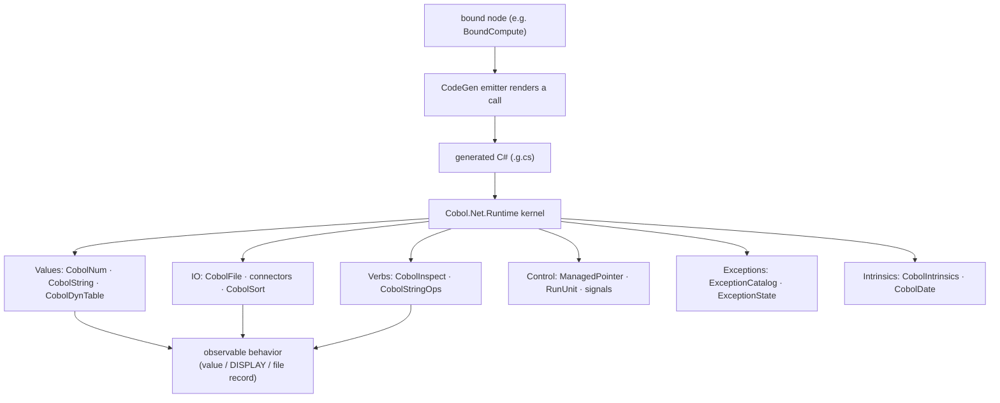
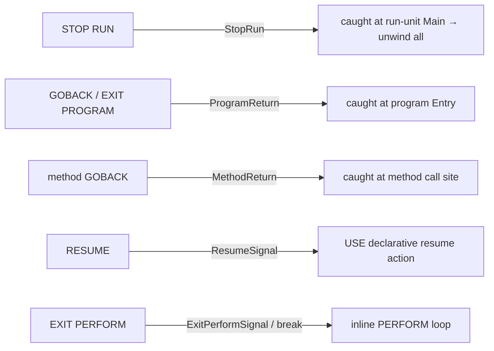

# Diagram — Runtime Behavior Flow

How a bound statement becomes observable runtime behavior via the typed-native runtime. Feeds
[[kb/Spec/Lookup/Runtime Mapping]] and [[kb/Runtime/Execution Model]].

## Emit → runtime call



## Signal model (control transfer as exceptions)



## Numeric store funnel (ROUNDED + ON SIZE ERROR)

```
operands (long/Int128) ─▶ widen to Int128 ─▶ scale-align ─▶ compute
                                                   │
                                          TryStore(receiver profile)
                                          • CobolRounding (8 modes)
                                          • bounds check → false = ON SIZE ERROR (receiver unchanged)
                                          • MODE PROHIBITED + inexact → SIZE ERROR
```

## See also
- [[kb/Runtime/Execution Model]] · [[kb/Spec/Lookup/Runtime Mapping]]
- [[kb/IR/Control Flow]] · [[kb/Diagrams/Compiler Pipeline Diagram]]

## Backlinks
- [[kb/Diagrams/MOC]] · [[kb/Spec/Lookup/Runtime Mapping]] — link here.
