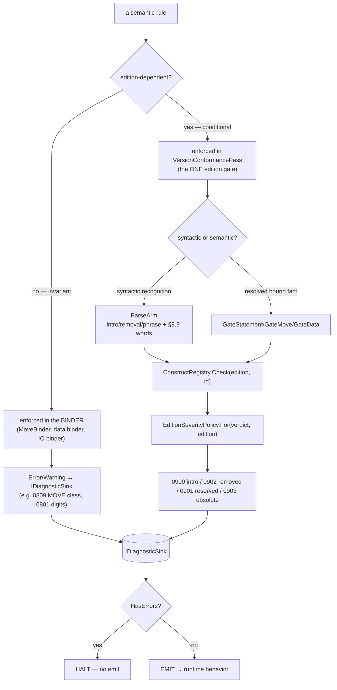

# Diagram — Semantic Rule Flow

How a semantic rule is enforced from bind to diagnostic. Companion to
[[kb/Diagrams/Semantic Validation Flow]]; feeds [[kb/Spec/Lookup/Semantic Rules]].

## Rule classification & routing

## Invariant vs conditional rules (examples)
| Rule | Kind | Enforced by |
|---|---|---|
| MOVE class legality (SR1) | invariant | `MoveBinder` (0809) |
| MOVE figurative category (SR5) | conditional | `VersionConformancePass.GateMove` |
| Digit capacity | conditional | `CheckDigitCapacity` (0801/0802) |
| EXIT format availability | conditional | `VersionConformancePass` (0900) |
| Condition precedence | invariant | binder |
| Reserved-word §8.9 | conditional | ParseArm funnel (0901) |

## See also
- [[kb/Semantics/Passes]] · [[kb/Semantics/Validation Rules]]
- [[kb/Spec/Lookup/Semantic Rules]] · [[kb/Diagrams/Semantic Validation Flow]]

## Backlinks
- [[kb/Diagrams/MOC]] · [[kb/Spec/Lookup/Semantic Rules]] — link here.
