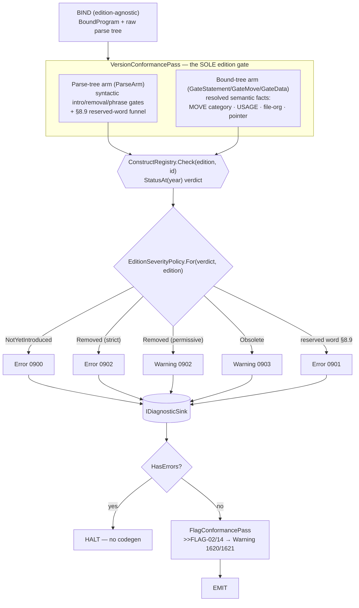

# Diagram — Semantic Validation Flow

Visualizes [[kb/Semantics/Passes]] and [[kb/Semantics/Validation Rules]] — the edition-gating and
diagnostics path.

## The two-arm edition gate (Mermaid)



## The reserved-word funnel (§8.9)

```
every user word ──► cobolWord rule ──► ParseArm.VisitCobolWord
                                          │
              position-blind (CheckedTokenTypes)  ── OR ──  position-aware (IsProvableUserWordPosition)
                                          │
                     ReservedWordSet  (4 sources: ISO §8.9 · VCR row32/Annex E.2 · GnuCOBOL 85/2002/2014)
                       + >>COBOL-WORDS overlay
                                          │
                   Confidence == "high"  ─► reject (0901)     (no-false-reject policy)
```

## Diagnostic descriptor anatomy

| Field | Meaning | Example |
|---|---|---|
| `Code` | emitted, may repeat | `COBOLNET0900` |
| `Id` | stable kebab-case, survives renumber | `construct-requires-edition` |
| `Severity` | Error / Warning / Info | Error |
| `IsoSection` | citation | §8.9 |
| `SuppressKey?` | suppress family | `recognized-not-implemented` |

## See also
- [[kb/Semantics/Passes]] · [[kb/Semantics/Validation Rules]]
- [[kb/Spec/Version Targeting]] · [[kb/Diagrams/Compiler Pipeline Diagram]]

## Backlinks
- [[kb/Diagrams/MOC]] · [[kb/Index]] — link here.
