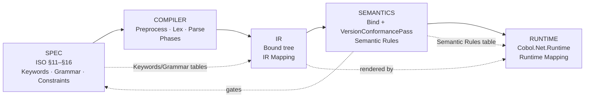

# 🔎 ISO COBOL Lookup — Master Index

A lookup and cross-reference layer over the ISO/IEC 1989:2023 language: from any **keyword**, **grammar construct**,
**semantic rule**, **IR node**, **runtime behavior**, or **constraint**, jump across the whole compiler
(**Spec → Compiler → IR → Semantics → Runtime**). Content is paraphrased/classified from the repo — no ISO text is
reproduced; § citations are kept for navigation.

## ⭐ Start here
1. Know a **word**? → [[kb/Spec/Lookup/Keywords]]
2. Know a **construct/statement**? → [[kb/Spec/Lookup/Grammar]]
3. Know a **rule**? → [[kb/Spec/Lookup/Semantic Rules]]
4. Know an **IR node** (`Bound*`)? → [[kb/Spec/Lookup/IR Mapping]]
5. Know a **runtime behavior**? → [[kb/Spec/Lookup/Runtime Mapping]]
6. Know a **limit/rule to obey**? → [[kb/Spec/Lookup/Constraints]]

7. Want the **full construct × edition inventory**? → [[kb/Spec/Lookup/Construct Catalogue]] (183 constructs)

## The lookup tables
| Table | What it maps | Columns |
|---|---|---|
| [[kb/Spec/Lookup/Keywords]] | keyword → everything | Keyword · Desc · Spec · Compiler · IR Node · Semantic Rule · Runtime |
| [[kb/Spec/Lookup/Grammar]] | divisions/sections/statements/expressions/data types | Construct · Summary · Spec · Compiler · IR · Semantics |
| [[kb/Spec/Lookup/Semantic Rules]] | rule → validation & IR | Rule · Desc · Spec Source · Validation Pass · IR Node · Runtime Impact |
| [[kb/Spec/Lookup/IR Mapping]] | `Bound*` node → spec/phase/diagram | IR Node · Purpose · Spec Construct · Semantic Rule · Phase · Diagram |
| [[kb/Spec/Lookup/Runtime Mapping]] | behavior → spec/IR/execution | Behavior · Desc · Spec Rule · IR Node · Semantic Rule · Execution Model |
| [[kb/Spec/Lookup/Constraints]] | limits & doctrine | Constraint · Desc · Spec · Enforcement · Semantic Rule · Notes |

**Plus the full edition inventory:** [[kb/Spec/Lookup/Construct Catalogue]] — all **183 constructs** ×
edition (introduced / removed / diagnostic / active-or-pending), grouped into 14 categories.

**And the diagnostic-code lookup:** [[kb/Spec/Lookup/Diagnostics]] — every `COBOLNET####` → meaning ·
severity · ISO § · **phase** · construct.

## 🔗 Cross-domain map
The five columns of the knowledge base, and how the lookup tables thread them:

| Layer | Domain MOC | Lookup table |
|---|---|---|
| Spec | [[kb/Spec/MOC]] | Keywords · Grammar · Constraints |
| Compiler | [[kb/Compiler/MOC]] | (phases referenced by every table) |
| IR | [[kb/IR/MOC]] | IR Mapping |
| Semantics | [[kb/Semantics/MOC]] | Semantic Rules |
| Runtime | [[kb/Runtime/MOC]] | Runtime Mapping |

## 📖 Glossary of ISO COBOL terms (quick)
- **Division / Section / Paragraph / Sentence / Statement** — the §11–§14 program hierarchy.
- **Elementary item / Group item** — a leaf field / a record of subordinate items (§13).
- **PICTURE / USAGE** — data category+size / physical representation (§13.16).
- **Figurative constant** — ZERO/SPACE/HIGH-VALUE/LOW-VALUE/QUOTE/ALL (§8.3.2).
- **Condition-name (88)** — a named truth-test over a value set (§8.8.4.4).
- **Intrinsic function** — a built-in FUNCTION (§15).
- **Exception condition (EC)** — a named runtime error condition (§14.6.12, Table 13).
- **Edition** — an ISO revision (1985/2002/2014/2023) selectable by `--std`.

Full vocabulary → [[kb/Search/Glossary]].

## See also
- [[kb/Spec/MOC]] — the Spec domain hub.
- [[kb/Search/Key Concepts]] — the semantic index.
- [[kb/Index]] — knowledge-base home.

## Backlinks
- [[kb/Spec/MOC]] · [[kb/Index]] — link here.
